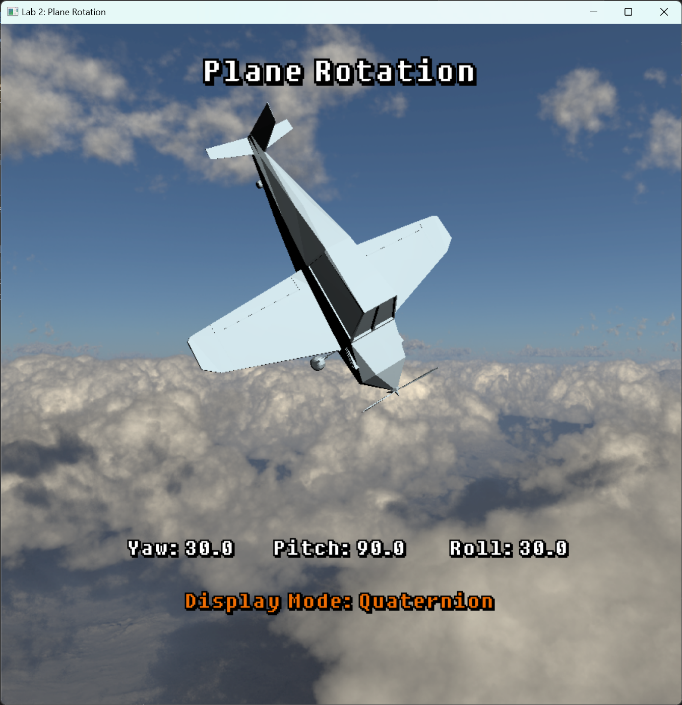

# CS7GV5 Lab 1 Report

## Student Information

| Name:           | Long Pan     |
| --------------- | ------------ |
| **Student I**D: | **21332147** |


## Project Features

### Required feature

> pitch, roll, and yaw rotations, using Euler Angles, demonstrate gimbal lock.

- **Screenshot(s) of feature**:

  When the Euler angle is in the order of Yaw, Pitch, Roll, modify the Pitch. When the Pitch reaches 90 degrees, Gimbal lock will appear.

  

  <p align="center">Figure 1: Gimbal lock appears, when the Pitch is 90°</p>

  

  <p align="center">Figure 2: The situation of modifying Yaw and Roll rotation is consistent</p>

- Code Snippet:

  ```C++
  view = glm::translate(glm::mat4(1.0f), glm::vec3(0.0f, 1.5f, -18.0f));
  proj = glm::perspective(glm::radians(45.0f), (float)width/(float)height,0.1f, 1000.0f);
  model = glm::mat4(1.0f);
  
  // root - plane
  glm::mat4 modelPlane = glm::mat4(1.0f);
  modelPlane = model * modelPlane;
  
  // Rotate using Euler angles
  glm::mat4 R = glm::yawPitchRoll(glm::radians(yaw), glm::radians(pitch), glm::radians(roll)); // Yaw, Pitch, Roll
  modelPlane = modelPlane * R;
  
  glUniformMatrix4fv(glGetUniformLocation(airplaneShaderProgram, "view"), 1, GL_FALSE, glm::value_ptr(view));
  glUniformMatrix4fv(glGetUniformLocation(airplaneShaderProgram, "proj"), 1, GL_FALSE, glm::value_ptr(proj));
  glUniformMatrix4fv(glGetUniformLocation(airplaneShaderProgram, "model"), 1, GL_FALSE, glm::value_ptr(modelPlane));
  ```


### Extra Features

#### 1. Overcome gimbal-lock

> Overcome gimbal-lock using quaternions to represent the rotation

- Screenshot(s) of feature:

  

  <p align="center">Figure 3: When the mode is quaternion and the pitch is 90°, no gimbal lock will appear</p>

  

  <p align="center">Figure 4: Modify Yaw and Roll, the direction of rotation is different</p>

- Code Snippet:

  ```c++
  view = glm::translate(glm::mat4(1.0f), glm::vec3(0.0f, 1.5f, -18.0f));
  proj = glm::perspective(glm::radians(45.0f), (float)width/(float)height,0.1f, 1000.0f);
  model = glm::mat4(1.0f);
  
  // root - plane
  glm::mat4 modelPlane = glm::mat4(1.0f);
  modelPlane = model * modelPlane;
  
  // Use the glm function
  glm::quat q = glm::quat(glm::vec3(glm::radians(pitch), glm::radians(yaw), glm::radians(roll)));  // Convert Euler angle to Quaternion
  glm::mat4 R = glm::mat4_cast(q);  // Convert quaternion to 4*4 matrix
  
  modelPlane = modelPlane * R;  // Apply the quaternion result
  
  glUniformMatrix4fv(glGetUniformLocation(airplaneShaderProgram, "view"), 1, GL_FALSE, glm::value_ptr(view));
  glUniformMatrix4fv(glGetUniformLocation(airplaneShaderProgram, "proj"), 1, GL_FALSE, glm::value_ptr(proj));
  glUniformMatrix4fv(glGetUniformLocation(airplaneShaderProgram, "model"), 1, GL_FALSE, glm::value_ptr(modelPlane));
  ```


#### 2. Hierarchical moving elements

> Hierarchical moving elements (e.g., propeller, wheels)

- Screenshot(s) of feature:

  

  <p align="center">Figure 5: The propeller is spinning</p>

  

  <p align="center">Figure 6: The propeller is spinning</p>

- Code Snippet:

  ```c++
  // display()
  
  // child - prop
  glBindVertexArray(prop_vao);
  
  glm::mat4 modelProp = glm::mat4(1.0f);
  modelProp = glm::translate(modelProp, glm::vec3(0.0f, 0.0f, 2.4f));
  modelProp = glm::rotate(modelProp, glm::radians(prop_rotate_y), glm::vec3(0.0f, 0.0f, 1.0f));
  
  // Apply the root matrix to the child matrix
  modelProp = modelPlane * modelProp;
  
  glUniformMatrix4fv(glGetUniformLocation(airplaneShaderProgram, "view"), 1, GL_FALSE, glm::value_ptr(view));
  glUniformMatrix4fv(glGetUniformLocation(airplaneShaderProgram, "proj"), 1, GL_FALSE, glm::value_ptr(proj));
  glUniformMatrix4fv(glGetUniformLocation(airplaneShaderProgram, "model"), 1, GL_FALSE, glm::value_ptr(modelProp));
  
  glDrawArrays(GL_TRIANGLES, 0, prop_data.mPointCount);
  ```

  ```c++
  // updateScene()
  
  static DWORD last_time = 0;
  DWORD curr_time = timeGetTime();
  if (last_time == 0)
  	last_time = curr_time;
  float delta = (curr_time - last_time) * 0.001f;
  last_time = curr_time;
  
  prop_rotate_y += 60.0f * delta;
  prop_rotate_y = fmodf(prop_rotate_y, 360.0f);
  ```

  

#### 3. Perspective switch

> Switch between first-person and third-person views

- Screenshot(s) of feature:

  

  <p align="center">Figure 7: Third-person Views</p>

  

  <p align="center">Figure 8: First-person Views</p>

- Code Snippet:

  ```c++
  if (isFirstView) { // First person view
  	glm::vec3 eye = glm::vec3(0.0f, 0.8f, 0.8f);
  	glm::vec3 center = glm::vec3(0.0f, 0.0f, 20.0f);
  	glm::mat4 rotation = glm::rotate(glm::mat4(1.0f), glm::radians(pitch), glm::vec3(1.0f, 0.0f, 0.0f));
  	rotation = glm::rotate(rotation, glm::radians(yaw), glm::vec3(0.0f, 1.0f, 0.0f));
  	rotation = glm::rotate(rotation, glm::radians(roll), glm::vec3(0.0f, 0.0f, 1.0f));
  	glm::vec3 eye_rotated = glm::vec3(rotation * glm::vec4(eye, 1.0f));
  	center = glm::vec3(rotation * glm::vec4(center, 1.0f));
  	view = glm::lookAt(eye_rotated, center, glm::vec3(rotation * glm::vec4(0.0f, 1.0f, 0.0f, 1.0f)));
  }
  else {  // Third person view
  	view = glm::translate(glm::mat4(1.0f), glm::vec3(0.0f, 1.5f, -18.0f));
  }
  ```

  

#### 4. 3D model

> Good visual appearance of the plane (e.g., Using 3D model rather than Cylinders)

- Screenshot(s) of feature:

  

  <p align="center">Figure 9: 3D plane model</p>

- Code Snippet:

  ```c++
  airplane_data = load_mesh("./models/plane_no_prop.dae"); // airplane
  prop_data = load_mesh("./models/prop.dae"); // prop
  
  glGenVertexArrays(1, &airplane_vao);
  glBindVertexArray(airplane_vao);
  glGenBuffers(1, &airplane_vp_vbo);
  glGenBuffers(1, &airplane_vn_vbo);
  generateObjectBufferMesh(airplaneShaderProgram, airplane_data, airplane_vao, airplane_vp_vbo, airplane_vn_vbo);
  
  glGenVertexArrays(1, &prop_vao);
  glBindVertexArray(prop_vao);
  glGenBuffers(1, &prop_vp_vbo);
  glGenBuffers(1, &prop_vn_vbo);
  generateObjectBufferMesh(airplaneShaderProgram, prop_data, prop_vao, prop_vp_vbo, prop_vn_vbo);
  ```

  

#### 5. Skybox

> Good visual appearance of the background

- Screenshot(s) of feature:

  

  <p align="center">Figure 10: Blue sky box model</p>

- Code Snippet:

  ```C++
  // ------------ SKYBOX ------------
  unsigned int skyboxVAO, skyboxVBO;
  unsigned int cubemapTexture;
  vector<std::string> faces
  {
  	"./skybox/right.jpg",
  	"./skybox/left.jpg",
  	"./skybox/top.jpg",
  	"./skybox/bottom.jpg",
  	"./skybox/front.jpg",
  	"./skybox/back.jpg"
  };
  
  float skyboxVertices[] = {
  	-200.0f,  200.0f, -200.0f,
  	-200.0f, -200.0f, -200.0f,
  	 200.0f, -200.0f, -200.0f,
  	 200.0f, -200.0f, -200.0f,
  	 200.0f,  200.0f, -200.0f,
  	-200.0f,  200.0f, -200.0f,
  
  	-200.0f, -200.0f,  200.0f,
  	-200.0f, -200.0f, -200.0f,
  	-200.0f,  200.0f, -200.0f,
  	-200.0f,  200.0f, -200.0f,
  	-200.0f,  200.0f,  200.0f,
  	-200.0f, -200.0f,  200.0f,
  
  	 200.0f, -200.0f, -200.0f,
  	 200.0f, -200.0f,  200.0f,
  	 200.0f,  200.0f,  200.0f,
  	 200.0f,  200.0f,  200.0f,
  	 200.0f,  200.0f, -200.0f,
  	 200.0f, -200.0f, -200.0f,
  
  	-200.0f, -200.0f,  200.0f,
  	-200.0f,  200.0f,  200.0f,
  	 200.0f,  200.0f,  200.0f,
  	 200.0f,  200.0f,  200.0f,
  	 200.0f, -200.0f,  200.0f,
  	-200.0f, -200.0f,  200.0f,
  
  	-200.0f,  200.0f, -200.0f,
  	 200.0f,  200.0f, -200.0f,
  	 200.0f,  200.0f,  200.0f,
  	 200.0f,  200.0f,  200.0f,
  	-200.0f,  200.0f,  200.0f,
  	-200.0f,  200.0f, -200.0f,
  
  	-200.0f, -200.0f, -200.0f,
  	-200.0f, -200.0f,  200.0f,
  	 200.0f, -200.0f, -200.0f,
  	 200.0f, -200.0f, -200.0f,
  	-200.0f, -200.0f,  200.0f,
  	 200.0f, -200.0f,  200.0f
  };
  ```

  ```c++
  // init()
  
  // Skybox
  generateSkybox();
  cubemapTexture = loadCubemap(faces);
  ```

  ```C++
  void generateSkybox() {
  	glGenVertexArrays(1, &skyboxVAO);
  	glGenBuffers(1, &skyboxVBO);
  	glBindVertexArray(skyboxVAO);
  	glBindBuffer(GL_ARRAY_BUFFER, skyboxVBO);
  	glBufferData(GL_ARRAY_BUFFER, sizeof(skyboxVertices), &skyboxVertices, GL_STATIC_DRAW);
  	glEnableVertexAttribArray(0);
  	glVertexAttribPointer(0, 3, GL_FLOAT, GL_FALSE, 3 * sizeof(float), (void*)0);
  }
  ```

  ```c++
  unsigned int loadCubemap(vector<std::string> faces)
  {
  	unsigned int skyboxTextureID;
  	glGenTextures(1, &skyboxTextureID);
  	glBindTexture(GL_TEXTURE_CUBE_MAP, skyboxTextureID);
  
  	int width, height, nrChannels;
  	for (unsigned int i = 0; i < faces.size(); i++)
  	{
  		unsigned char* data = stbi_load(faces[i].c_str(), &width, &height, &nrChannels, 0);
  		glTexImage2D(GL_TEXTURE_CUBE_MAP_POSITIVE_X + i, 0, GL_RGB, width, height, 0, GL_RGB, GL_UNSIGNED_BYTE, data);
  		stbi_image_free(data);
  	}
  
  	glTexParameteri(GL_TEXTURE_CUBE_MAP, GL_TEXTURE_MIN_FILTER, GL_LINEAR);
  	glTexParameteri(GL_TEXTURE_CUBE_MAP, GL_TEXTURE_MAG_FILTER, GL_LINEAR);
  	glTexParameteri(GL_TEXTURE_CUBE_MAP, GL_TEXTURE_WRAP_S, GL_CLAMP_TO_EDGE);
  	glTexParameteri(GL_TEXTURE_CUBE_MAP, GL_TEXTURE_WRAP_T, GL_CLAMP_TO_EDGE);
  	glTexParameteri(GL_TEXTURE_CUBE_MAP, GL_TEXTURE_WRAP_R, GL_CLAMP_TO_EDGE);
  
  	return skyboxTextureID;
  }
  ```

  ```c++
  void drawSkybox() {
  	glDepthFunc(GL_LEQUAL);
  	glUseProgram(skyboxShaderProgramID);
  
  	glUniformMatrix4fv(glGetUniformLocation(skyboxShaderProgramID, "view"), 1, GL_FALSE, glm::value_ptr(view));
  	glUniformMatrix4fv(glGetUniformLocation(skyboxShaderProgramID, "proj"), 1, GL_FALSE, glm::value_ptr(proj));
  
  	glBindVertexArray(skyboxVAO);
  	glActiveTexture(GL_TEXTURE0);
  	glBindTexture(GL_TEXTURE_CUBE_MAP, cubemapTexture);
  	glDrawArrays(GL_TRIANGLES, 0, 36);
  	glDepthFunc(GL_LESS);
  	glDepthMask(GL_TRUE);
  }
  ```

  

#### 6. Methods Compared

> Compared different rotation methods

- Screenshot(s) of feature:

  

  <p align="center">Figure 11: Matrix Method</p>

  

  <p align="center">Figure 12: Euler Method</p>

  

  <p align="center">Figure 13: Quaternion Method</p>

- Code Snippet:

  ```c++
  if (displayMode == 0) {  // 4x4 transformation matrix
  	modelPlane = glm::translate(modelPlane, glm::vec3(0.0f, 0.0f, 0.0f));
  	modelPlane = glm::rotate(modelPlane, glm::radians(pitch), glm::vec3(1.0f, 0.0f, 0.0f));
  	modelPlane = glm::rotate(modelPlane, glm::radians(yaw), glm::vec3(0.0f, 1.0f, 0.0f));
  	modelPlane = glm::rotate(modelPlane, glm::radians(roll), glm::vec3(0.0f, 0.0f, 1.0f));
  }
  
  else if (displayMode == 1) {  // Euler: Yaw, Pitch, Roll
  	glm::mat4 R = glm::yawPitchRoll(glm::radians(yaw), glm::radians(pitch), glm::radians(roll)); // Yaw, Pitch, Roll
  	modelPlane = modelPlane * R;
  }
  
  else if (displayMode == 2) {  // Quaternion
  	// Use the glm function directly
  	glm::quat q = glm::quat(glm::vec3(glm::radians(pitch), glm::radians(yaw), glm::radians(roll)));  // Convert Euler angle to Quaternion
  	glm::mat4 R = glm::mat4_cast(q);  // Convert quaternion to 4*4 matrix
  
  	modelPlane = modelPlane * R;  // Apply the quaternion result
  }
  ```
  
  
