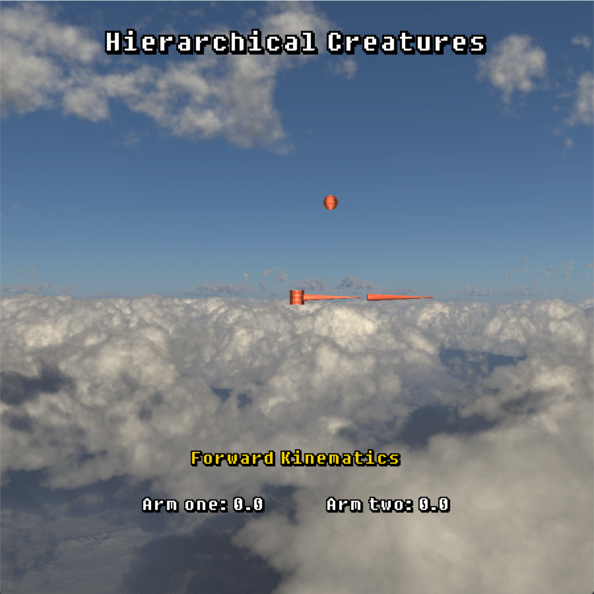
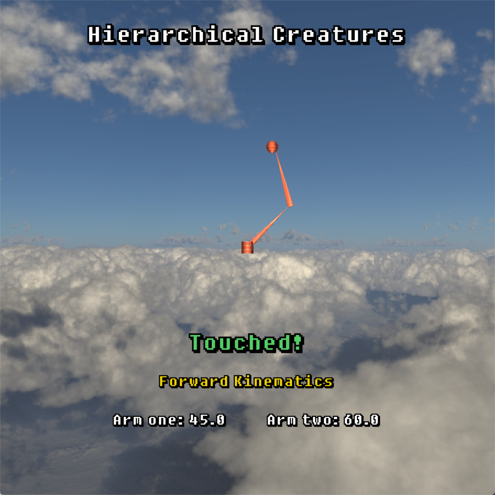
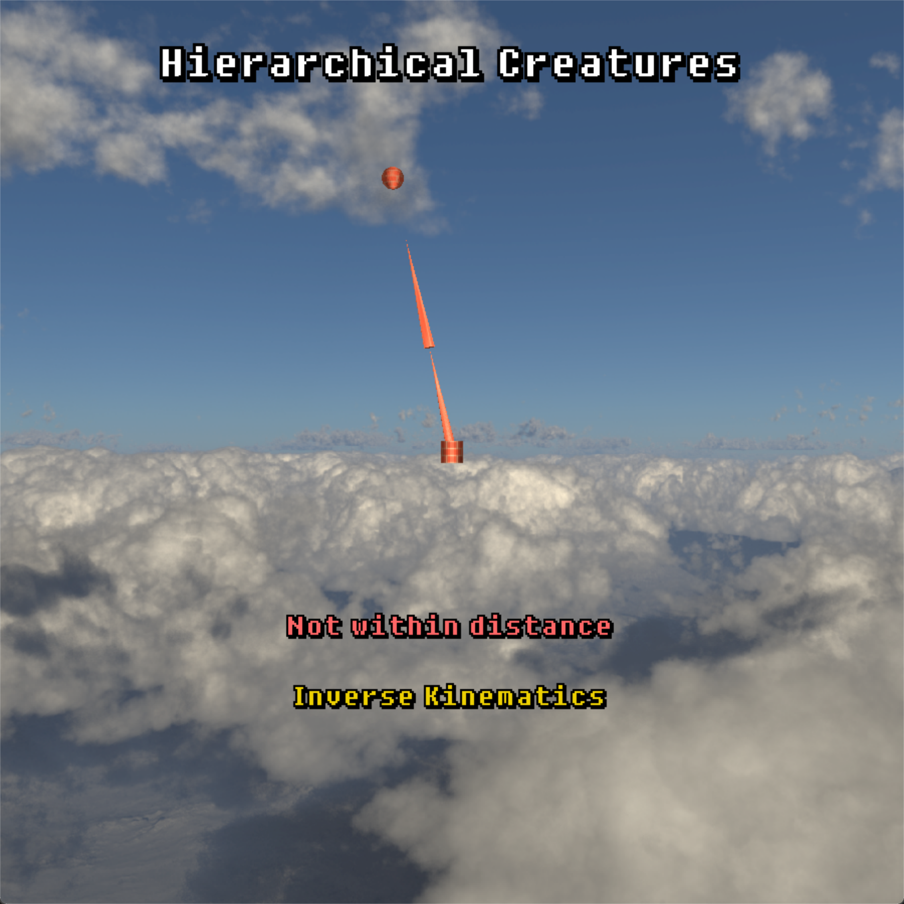
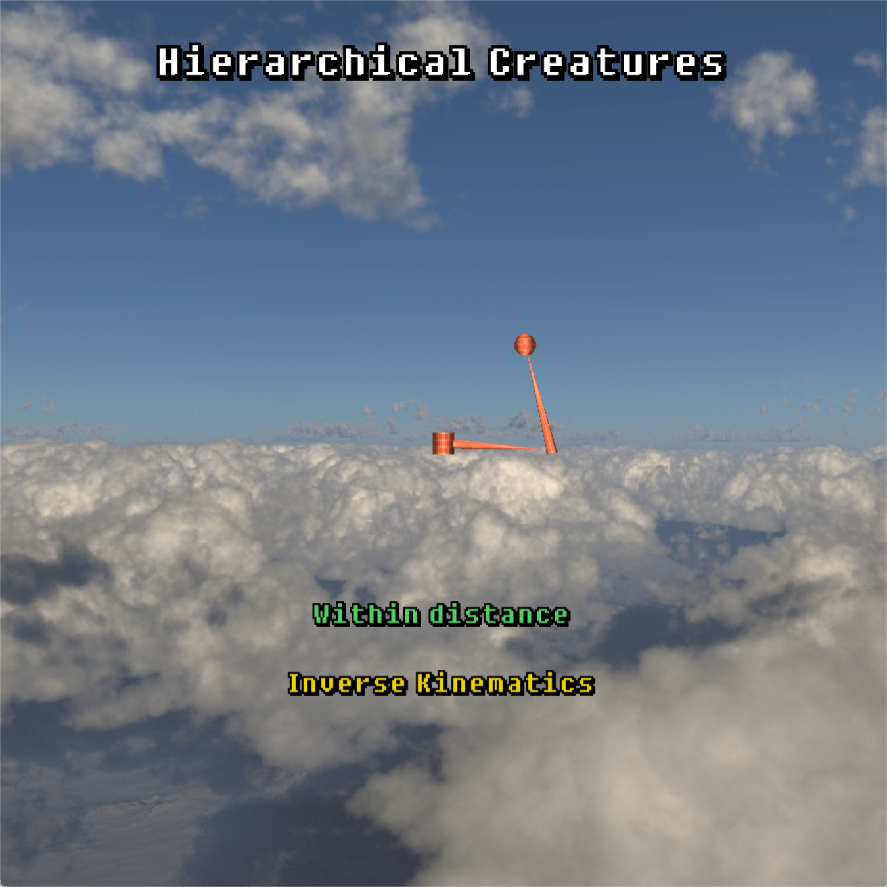
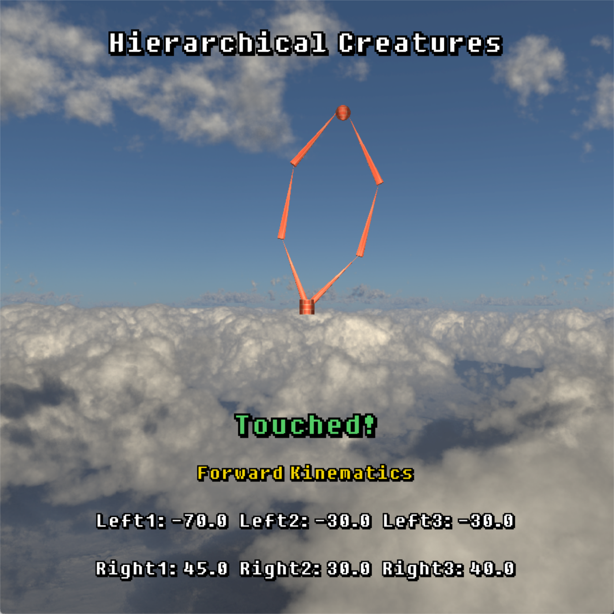
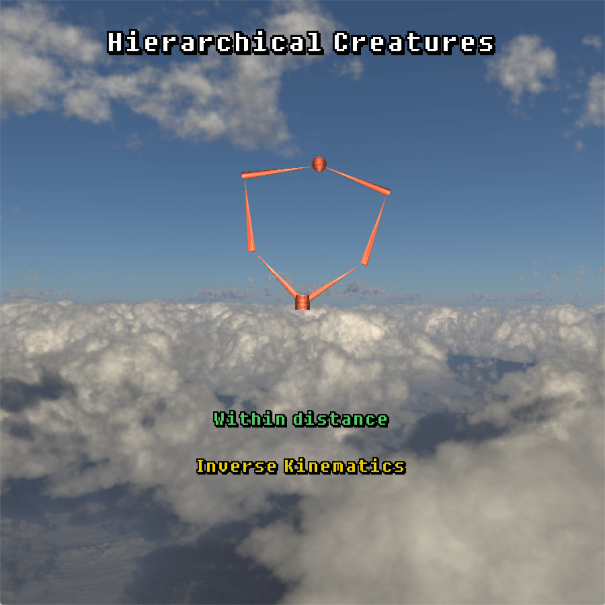
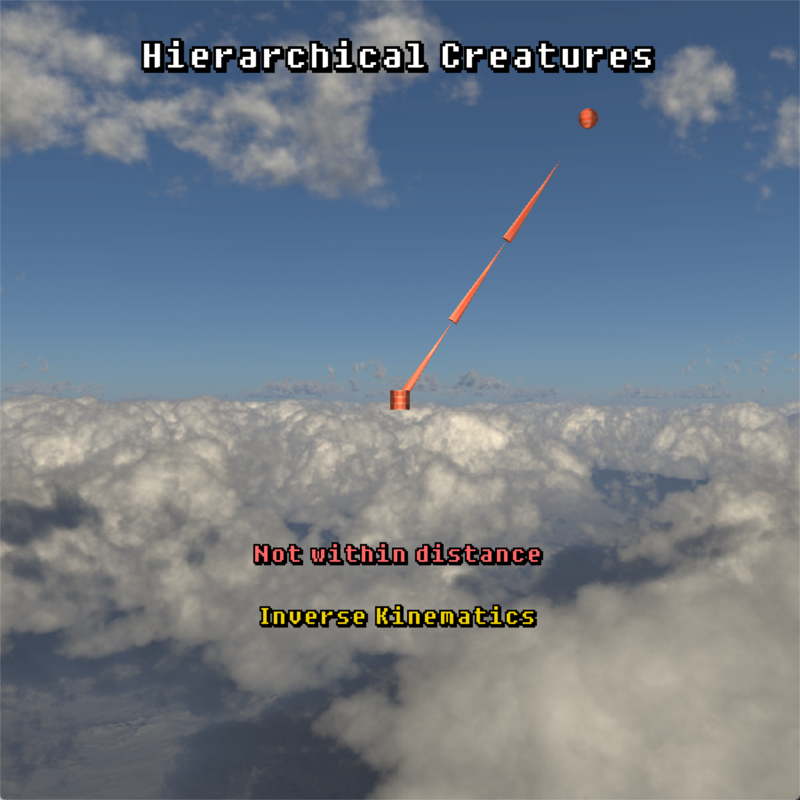
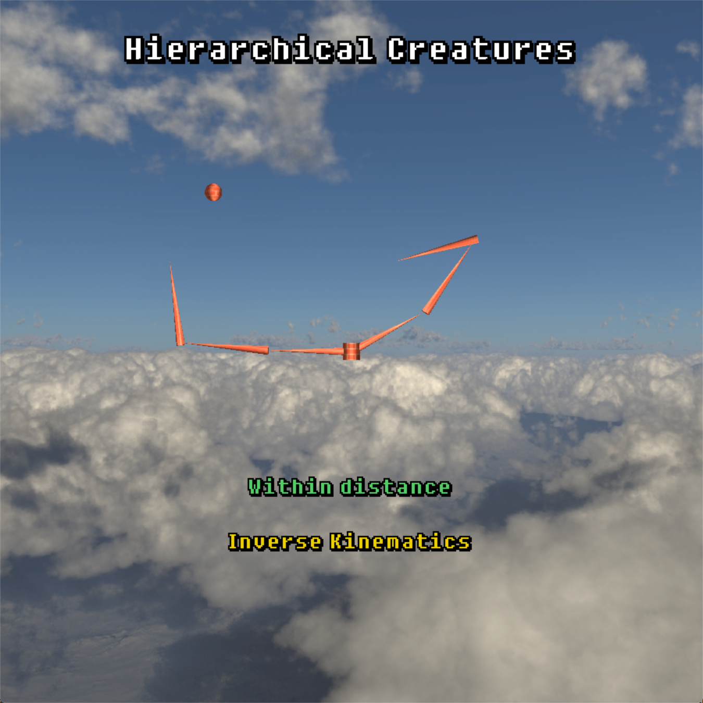

# Assignment 2 Report

## Student Information

| Name:           | Long Pan     |
| --------------- | ------------ |
| **Student I**D: | **21332147** |


## Project Features

### Simple 2-bone IK in 2D

- **Screenshot(s) of feature**:

  

  <p align="center">Figure 1: Simple 2-bone IK in 2D</p>

  

  <p align="center">Figure 2: Simple 2-bone FK in 2D</p>

  

  <p align="center">Figure 3: Simple 2-bone IK in 2D not within distance</p>

  

  <p align="center">Figure 4: Simple 2-bone IK in 2D within distance</p>

- Describe implementation:

  I created a Node class in the code to represent each joint. Then bind some attributes in the class, such as parent nodes and child nodes, so that the nodes can be linked after the nodes are created. The Simple 2-bone here is created and linked in this way. Then there are some attributes in this class, which can set the position, rotation, scaling, etc. of the joint, and convert them into a matrix for storage.

  For the `FK` part, the modification can be completed directly by calling the corresponding rotation function in the attribute. Here I use an array `a_z` specially used to store the rotation angle around the z axis.

  ```c++
  arm1->setRotation(a_z[0]);
  arm2->setRotation(a_z[1]);
  ```

  For the IK part, I used to create a class that is specially used to solve the IK part. For simple 2-joint models, I use the Analytical solution. The angle of each joint in the case of two joints is obtained by trigonometric function calculation.

- Code Snippet:

  - Node Class:

  ```C++
  class Node {
  public:
  	string m_nodeName;  // The name of the node.
  
  	Node* m_pParent;  // A pointer to the parent node.
  	vector<Node*> m_lChildren;  // A vector of pointers to the child nodes.
  
  	glm::mat4 m_transform;  // The local transform matrix of the node.
  	glm::vec3 m_end_pos;  // The end position of the node in world space.
  	glm::vec3 m_direction = glm::vec3(0, 1, 0);  // The direction vector of the node.
  
  	GLuint m_type;  // The type of the node.
      // The length of the node (used for calculating the end position).
  	float m_length = 1.0f;  
  
  	// Constructor that takes the node name, type and parent node as input.
  	Node(const std::string& nodeName = "", GLuint type = 0, Node* pParent = nullptr)
  		: m_nodeName(nodeName), m_type(type), m_pParent(pParent) {
  		m_transform = glm::mat4(1.0f);
         	// Initialize the transform matrix to the identity matrix.
  	}
  
  	// Adds a child node to the current node.
  	void addChild(Node* pChild) {
  		m_lChildren.push_back(pChild);  // Add the child node to the vector.
           // Set the parent of the child node to the current node.
  		pChild->m_pParent = this;
  	}
  
  	// Returns the type of the node.
  	GLuint getMType() const {
  		return m_type;
  	}
  
  	// Returns the world transform matrix of the node.
  	glm::mat4 getWorldTransform() const {
  		if (m_pParent) {  // If the node has a parent
              // concatenate parent's world transform with the node's local transform.
  			return m_pParent->getWorldTransform() * m_transform;
  		}
  		else { //  If the node doesn't have a parent
              // return the local transform as the world transform.
  		 	return m_transform;  
  		}
  	}
  
  	// Sets the translation of the node.
  	void setTranslation(float x, float y, float z) {
  		m_transform = glm::translate(m_transform, glm::vec3(x, y, z));
  	}
  
  	// Sets the scale of the node.
  	void setScale(float scale) {
  		m_transform = glm::scale(m_transform, glm::vec3(scale));
  	}
  
  	// Sets the rotation of the node.
  	void setRotation(float angle, float x = 0, float y = 0, float z = 1) {
  		m_transform = glm::rotate(m_transform, glm::radians(angle), glm::vec3(x, y, z));
  	}
  
  	// Calculates and returns the end position of the node in world space.
  	glm::vec3 getEndPosition() {
           // Calculate the end position in local space.
  		glm::vec4 end_pos_local = glm::vec4(0, m_length, 0, 1);  
           // Convert the end position to world space using the node's world transform.
  		glm::vec4 end_pos_world = getWorldTransform() * end_pos_local;  
           // Store the end position in a member variable for later use.
  		m_end_pos = glm::vec3(end_pos_world.x, end_pos_world.y, end_pos_world.z);  
  		return m_end_pos;
  	}
  };
  ```

  - Create Nodes

  ```C++
  // Display function
  
  // ----------------------------------- Create nodes -----------------------------------
  Node* root = new Node("root", 0);
  root->setTranslation(0.0f, 0.0f, same_z);
  
  Node* arm1 = new Node("arm1", 1);
  arm1->setTranslation(0.0f, 0.0f, 0.0f);
  arm1->setRotation(-90.0);
  root->addChild(arm1);
  
  Node* arm2 = new Node("arm2", 1);
  arm2->setTranslation(0.0f, 1.0f, 0.0f);
  arm1->addChild(arm2);
  ```

  - SimpleJointIK Code:

  ```C++
  class SimpleJointIK {
  public:
  	Node* m_start;
  	Node* m_end;
  
  	glm::vec3 m_target;
  	glm::vec3 m_startPos;
  	glm::vec3 m_endPos;
  
  	float m_totalLength;
  	float m_armLength = 1;  // Length of arm. And each arm's length is the same.
  	float m_jointAngles[5];
  
  	GLuint m_depth = 3;  // Depth of joints
  	GLuint m_index = 0;  // Depth of joints
  
  	SimpleJointIK(Node* startNode, Node* endNode, float length) {
  		m_start = startNode;
  		m_end = endNode;
  
  		// Calculate total length
  		m_totalLength = length * m_armLength;
           // Get position from transform matrix
  		m_startPos = startNode->getWorldTransform()[3];    
  
  		// Initialize joint angles to 0
  		m_jointAngles[0] = 0.0f;
  		m_jointAngles[1] = 0.0f;
  		m_jointAngles[2] = 0.0f;
  		m_jointAngles[3] = 0.0f;
  		m_jointAngles[4] = 0.0f;
  	}
  
  	void setTargetPosition(const glm::vec3& target) {
  		m_target = target - m_startPos;
  	}
  
  	void setJointsRotation(Node* node) {
  		// Do something with the current node
  		node->setRotation(m_jointAngles[m_index++]);
  
  		// Recursively traverse all child nodes
  		for (auto& child : node->m_lChildren) {
  			setJointsRotation(child);
  		}
  	}
  
  	bool checkDistance() {
  		// Calculate distance to target
  		float distanceToTarget = glm::length(m_target);
  
  		float x = m_target.x;
  		float y = m_target.y;
  
  		if (distanceToTarget >= m_totalLength) {
  			float angle1 = glm::degrees(acos(x / sqrt(x * x + y * y)));
  			if (y < 0) angle1 = -angle1;
  
  			if (m_start->m_nodeName == "arm4") angle1 += 180;
               // Target is out of reach, so the angle of each joint is the same.
  			m_jointAngles[0] = angle1;  
  			m_jointAngles[1] = 0.0f;
  
  			// Set joint angles
  			setJointsRotation(m_start);
  
  			// Show text
  			isWithinDis = false;
  
  			return true;
  		}
  		isWithinDis = true;
  		return false;
  	}
  
  	void solveAnalyticalSolution() {
  		float x = m_target.x;
  		float y = m_target.y;
  
  		// Check if distance of arm and target are out of reach.
  		if (checkDistance()) return;
  
  		// Distance is in the range, solve it using analytical solution
  		float a = m_armLength;
  		float b = a;
  
  		// Calculate the angle of joint2 using cosine law
  		float angleTheta = acos((a * a + b * b - x * x - y * y) / (2 * a * b));
  		float angle2 = 180 - glm::degrees(angleTheta);
  
  		// Calculate the angle of joint1 using cosine law
  		float acos1 = acos((a * a + (x * x + y * y) - b * b) / (2 * a * sqrt(x * x + y * y)));
  		float atanT = atan(y / x);
  		float angle1 = glm::degrees(atanT - acos1);
  		if (x < 0) angle1 = 180 + angle1;
  
  		// Store the angles
  		m_jointAngles[0] = angle1;
  		m_jointAngles[1] = angle2;
  
  		// Set joint angles
  		setJointsRotation(m_start);
  	}
  };
  ```

  

### Multi-bone IK in 3D

- Screenshot(s) of feature:

  

  <p align="center">Figure 5: Multi-bone FK</p>

  

  <p align="center">Figure 6: Multi-bone IK within distance</p>

  

  <p align="center">Figure 7: Multi-bone IK not within distance</p>

- Describe implementation:

  For the part of the complex model, I used a one-to-many approach, and then showed two joint branches, each with 3 joints. The implementation is still based on the Node class code. Then by instantiating multiple nodes, they are linked together.
  
  For the `FK` part, it is still by modifying the rotation function in Node, and by modifying each corner, so that the two final points can touch the target point.
  
  For the `IK` part, a CCD solution was used. By continuously iterating the angle of each joint, it gradually approaches the target point. I added a function to the code of `SimpleJointIK`, `solveCCDSolution` is specially used to use `CCD` to get the solution.
  
  
  
- Code Snippet:

  ```c++
  void solveCCDSolution(int maxIterations, float deltaThreshold, glm::vec3 targetPos) {
  
  	// Start iteration
  	for (int iteration = 0; iteration < maxIterations; iteration++) {
  		m_endPos = m_end->getEndPosition();
  
  		// Check if the end effector is close enough to the target
  		glm::vec3 delta = targetPos - m_endPos;
  		if (glm::length(delta) <= deltaThreshold) {
  			return;
  		}
  
  		// Get current joint
  		Node* curr = m_end;
  
  		// Iterate over the joints in reverse order
  		while (curr->m_pParent) {  // joint node instead of root node
  
  			// Get current joint start position
  			glm::vec3 startPos = curr->getWorldTransform()[3];
  
  			// Compute the vector from the current joint to the end effector
  			glm::vec3 jointToEnd = m_endPos - startPos;
  
  			// Compute the vector from the current joint to the target
  			glm::vec3 jointToTarget = targetPos - startPos;
  
  			// Compute the angle between the two vectors
  			float angle = atan2(glm::length(glm::cross(jointToEnd, jointToTarget)), glm::dot(jointToEnd, jointToTarget));
  			glm::vec3 crossProduct = glm::cross(jointToEnd, jointToTarget);
  			if (crossProduct.z < 0) angle = -angle;
  
  			// Set the rotation around the z-axis
  			curr->setRotation(glm::degrees(angle), 0, 0, 1);
  
  			// Apply the current node's transform to endPos
  			m_endPos = m_end->getEndPosition();
  
  			// Check if the end effector is close enough to the target
  			delta = targetPos - m_endPos;
  			if (glm::length(delta) <= deltaThreshold) {
  				return;
  			}
  
  			// Update current joint
  			curr = curr->m_pParent;
  		}
  	}
  }
  ```

  ```c++
  // display function
  
  // ------------------------------------- Set Display Mode ----------------------------
  if (displayMode) { // FK
  	arm1->setRotation(a_z[0]);
  	arm2->setRotation(a_z[1]);
  
  	// Calculate if the end node has touched target point.
  	float dis = glm::length(glm::vec3(target[0], target[1], same_z) - arm2->getEndPosition());
  	isTouched = dis <= 0.1;
  
  	if (modelType == "complex") {
  		arm3->setRotation(a_z[2]);
  		arm4->setRotation(a_z[3]);
  		arm5->setRotation(a_z[4]);
  		arm6->setRotation(a_z[5]);
  
  		// Calculate if the end node has touched target point.
  		float dis1 = glm::length(glm::vec3(target[0], target[1], same_z) - arm3->getEndPosition());
  		float dis2 = glm::length(glm::vec3(target[0], target[1], same_z) - arm6->getEndPosition());
  		isTouched = dis1 <= 0.1 && dis2 <= 0.1;
  	}
  
  }
  else {  // IK
  	// Solve IK
  	SimpleJointIK ikSolver(arm1, arm3, 3);
  	if (modelType == "simple") { // Analytical solution
  		// Solve IK
  		SimpleJointIK ikSolver(arm1, arm2, 2);
  
  		ikSolver.setTargetPosition(glm::vec3(target[0], target[1], same_z));
  
  		// Analytical solution only support 2 arms.
  			ikSolver.solveAnalyticalSolution();
  	}
  	else {
  		// Solve IK
  		SimpleJointIK ikSolver(arm1, arm3, 3);
  		SimpleJointIK ikSolver2(arm4, arm6, 3);
  
  		ikSolver.setTargetPosition(glm::vec3(target[0], target[1], same_z));
  		ikSolver2.setTargetPosition(glm::vec3(target[0], target[1], same_z));
  
  		// Solve IK with CCD solution and using spline animation
  		ikSolver.animate(delta);
  		ikSolver2.animate(delta);
  	}
  }
  ```


### Scripted animation

- Screenshot(s) of feature:

  

  <p align="center">Figure 7: Scripted animation</p>


- Describe implementation:

  For the animation, I used a `Catmull-Rom` spline to create curves between the start and end points. Then generate 100 key frames, and finally pass the positions of the key frames to the `CCD` model one by one, so that a smooth `CCD` solution result can be achieved.

- Code Snippet:

  ```C++
  void animate(float deltaTime) {
  	if (checkDistance()) return;  // Check if distance of arm and target out of reach
  
  	// Declare variables for tracking the current animation frame and the total elapsed time.
  	static float elapsedTime = 0.0f; // record elapsed time
  	static int currentFrame = 0; // Record the current frame number
  
  	// Define constants for the animation duration and the number of frames in the animation.
  	const float animationDuration = 1.0f; // animation duration in seconds
  	const int numFrames = 100; // The total number of frames of the animation
  	const float timePerFrame = animationDuration / numFrames; // The time spent per frame, in seconds
  
  	// Check if the target position has changed since the last frame.
  	if (!isTargetSame) {
  		// If it has changed, reset the elapsed time and current frame number to start a new animation.
  		elapsedTime = 0.0f;
  		currentFrame = 0;
  	}
  
  	// Calculate which frame should be updated based on the current elapsed time.
  	elapsedTime += deltaTime;
  	int targetFrame = (int)(elapsedTime / timePerFrame);
  	targetFrame = glm::clamp(targetFrame, 0, numFrames - 1);
  
  	// Create a set of control points to use for the spline curve that the arm will follow during the animation.
  	std::vector<glm::vec3> controlPoints;
  
  	// Get the end position of the IK chain and set it as the start position of the Catmull-Rom spline
  	glm::vec3 startPos = m_end->getEndPosition();
  	controlPoints.push_back(startPos);
  
  	// Add the current target position as a control point
  	controlPoints.push_back(m_target);
  
  	// Calculate two additional control points that are a quarter and three-quarters of the way between the start position and the target position
  	glm::vec3 quarterPoint = startPos + (m_target - startPos) * 0.25f;
  	glm::vec3 threeQuarterPoint = startPos + (m_target - startPos) * 0.75f;
  
  	// Add the calculated control points to the vector of control points
  	controlPoints.push_back(quarterPoint);
  	controlPoints.push_back(threeQuarterPoint);
  
  	// Generate a set of spline points that the arm will follow during the animation.
  	std::vector<glm::vec3> splinePoints;
  	// Sample the spline by iterating over a range of values for t
  	for (float t = 0.0f; t <= 1.0f; t += 0.01f) {
  		// Evaluate the Catmull-Rom spline at the current value of t using the control points
  		glm::vec3 point = glm::catmullRom(controlPoints[2], controlPoints[0], controlPoints[1], controlPoints[3], t);
  		// Add the evaluated point to the vector of spline points
  		splinePoints.push_back(point);
  	}
  
  	// Create a set of end positions to use for calculating the target position of the arm during the animation.
  	std::vector<glm::vec3> endPositions;
  	endPositions.push_back(m_end->getEndPosition());
  
  	// Calculate the target position of the arm based on the current animation frame.
  	glm::vec3 splinePoint = splinePoints[targetFrame];
  	glm::vec3 targetPos = (1.0f - targetFrame / (float)numFrames) * endPositions[0] + (targetFrame / (float)numFrames) * splinePoint;
  
  	// Update the IK animation to move the arm towards the target position.
  	solveCCDSolution(10, 0.05f, targetPos);
  
  	// If the current animation frame has changed, update the currentFrame variable.
  	if (targetFrame != currentFrame) {
  		currentFrame = targetFrame;
  	}
  
  	// Add the current end position of the arm to the set of end positions.
  	endPositions.push_back(m_end->getEndPosition());
  }
  
  ```

  

