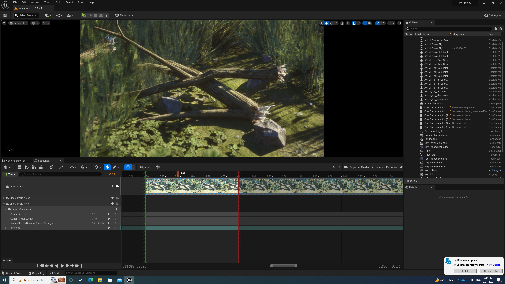
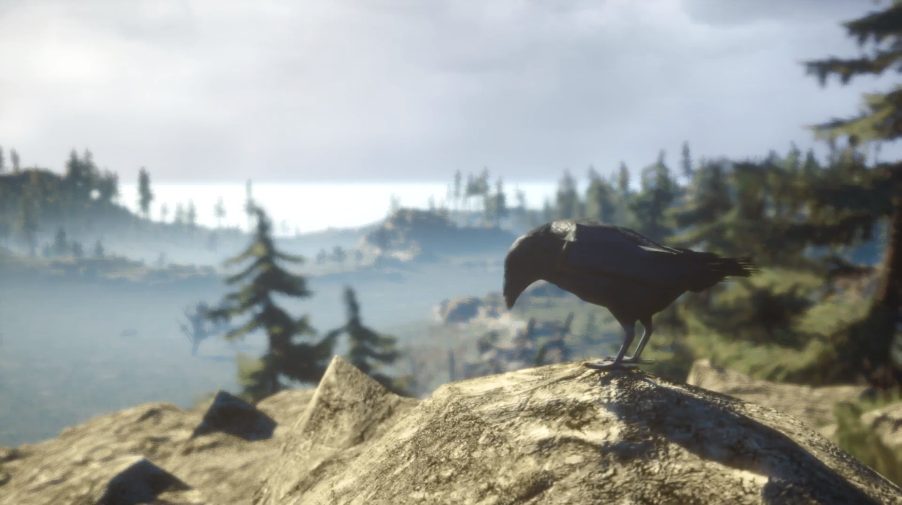

# CS7GV5-Final Assignment Proposal

## Introduction

This project is implemented using `UE 5.0`(**Unreal Engine 5.0**) version. The purpose is to create an Interactive Movie. I plan to use ready-made scenes and animated characters to create a wild scene, and then record the living conditions of different animals and the daily activities that happen between animals.

## Final Trailer

This project is developed based on environment pack: [MAE Oak Forest](https://www.unrealengine.com/marketplace/en-US/product/mae-oak-forest) and character pack: [AFRICAN ANIMALS PACK](https://www.unrealengine.com/marketplace/en-US/product/african-animals-pack) and [ANIMAL VARIETY PACK](https://www.unrealengine.com/marketplace/en-US/product/17c2d7d545674204a7644c3c0c4c58ba). And refer to the Unreal Engine 5 Beginner Tutorial - UE5 Starter Course tutorial of [Unreal Sensei](https://www.youtube.com/@UnrealSensei).

This trailer uses a total of three `sequencers` to implement, and these three sequences exist in a `master sequence`. The average length of each `sequencer` is 15 seconds, with slight adjustments based on content.

Each `sequencer` primarily uses `keyframes` to achieve the final effect. At the starting position, set the starting position of the camera and the character to be transformed, and set the corresponding `transform keyframe`, and then set the end position of the moved camera and the object after a certain period of time, and set the `keyframe`. At this time, UE will automatically complete the tween animation of the screen and the character through the set start position and end position, so as to realize the moving effect. In addition, the `focus effect` of the camera is also set, allowing the camera to focus from far to near, as well as translation and rotation.

This is the final result: 

- Youtube Link: [CS7GV5 - Real-time Animation Final Assignment Movie Trailer - YouTube](https://www.youtube.com/watch?v=MCGwKY-gtpg&ab_channel=LongPan)

## Future

In the later stage, more animals will be added, and then I will try to shoot a picture of a crocodile waiting for an opportunity to eat a deer that is drinking water.